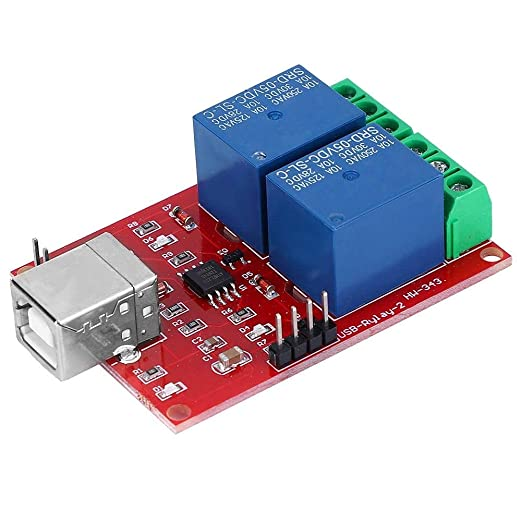

## Intro
Project to control USB relay modules based on HID technology.


## CI Status
[](https://github.com/nkh-lab/usb-relay-module/actions/workflows/ci.yml)
- Ubuntu
- Windows 

## How to get the project source code
Clone main git project:
```
$ git clone https://github.com/nkh-lab/usb-relay-module.git
```
Clone submodule projects:
```
$ git submodule update --init
```
## Depedencies
### Linux
For Ubuntu:
```
$ sudo apt-get install libudev-dev libusb-1.0-0-dev libfox-1.6-dev
```
## How to build
### Linux
```
$ mkdir build && cd build
$ cmake ..
$ make
```
### Windows
The following describes how to build the project from the command line for the compiler from Visual Studio.

Add `msbuild` to `PATH` environment variable:
```
set PATH=%PATH%;<path to msbuild>
```
```
$ mkdir build && cd build
$ cmake -G "Visual Studio 17 2022" -A Win32 .. 
$ cmake --build . --config Release
```

## How to use getrelay and setrelay
These are CLI applications, please use the help command to see usage description:
```
$ ./getrelay -h
Usage:
    <ModuleName>_<ChannelNumber>    Return a state 0 or 1 of the requested channel (numbering starts from 1)
    <ModuleName>                    Return full information about the requested module
    <>                              No arguments provided, return full information about all detected modules

Service commands:
    -h | --help                     Display this help text
    -v | --version                  Display version information
```
```
$ ./setrelay -h
Usage:
    <ModuleName>_<ChannelNumber>=<StateToSet>    Set the state 0 or 1 of the specified channel (numbering starts from 1)
    <ModuleName>=<NewModuleName>                 Rename module

Service commands:
    -h | --help                                  Display this help text
    -v | --version                               Display version information
```

## How to build tests
### Linux
Supports both Unit and Component tests:
```
$ cmake -Dusbrelaymodule_BUILD_UTESTS=on -Dusbrelaymodule_BUILD_CTESTS=on ..
$ make
```
### Windows
Supports only Component tests:
```
$ cmake -G "Visual Studio 17 2022" -A Win32 -Dusbrelaymodule_BUILD_CTESTS=on .. 
$ cmake --build . --config Release
```


