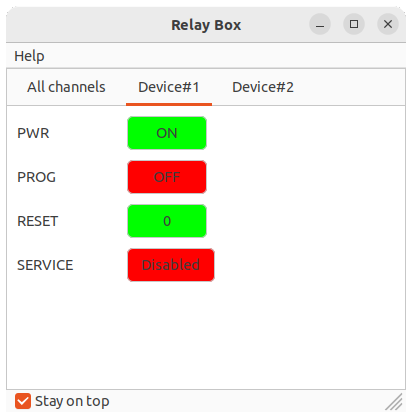
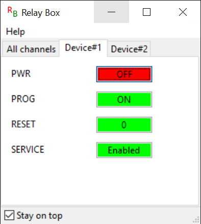
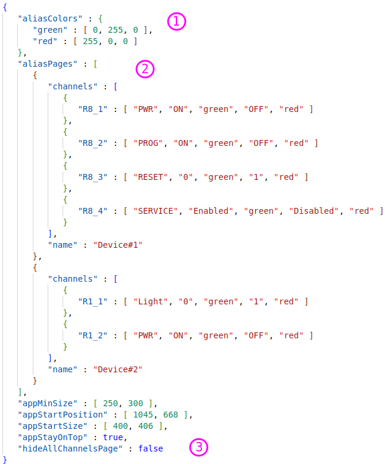

## Intro
The GUI part of the project is based on the wxWidgets cross-platform library and now supports Linux and Windows platforms.

Examples of an application view

Linux (Ubuntu):



Windows 10:



## How to build GUI application
Run `cmake` with `-Dusbrelaymodule_BUILD_GUI=on` option.

### Linux
1. Install dependencies
```
$ sudo apt-get install libudev-dev libwxgtk3.0-gtk3-dev
```
2. Build
```
cmake -Dusbrelaymodule_BUILD_GUI=ON ..
make
```

### Windows
1. Downloads prebuilts libraries (Debug and Release) and hedears from [wxWidgets/releases](https://github.com/wxWidgets/wxWidgets/releases), for example for [wxWidgets 3.2.1](https://github.com/wxWidgets/wxWidgets/releases/tag/v3.2.1) version:
- Debug libraries: [wxMSW-3.2.1_vc14x_x64_Dev.7z](https://github.com/wxWidgets/wxWidgets/releases/download/v3.2.1/wxMSW-3.2.1_vc14x_x64_Dev.7z)
- Release libraries: [wxMSW-3.2.1_vc14x_x64_ReleaseDLL.7z](https://github.com/wxWidgets/wxWidgets/releases/download/v3.2.1/wxMSW-3.2.1_vc14x_x64_ReleaseDLL.7z)
- Headers: [wxWidgets-3.2.1-headers.7z](https://github.com/wxWidgets/wxWidgets/releases/download/v3.2.1/wxWidgets-3.2.1-headers.7z)
2. Unpack and copy/link downloaded stuff to project prebuilt folder:
```
mkdir prebuilt\wxwidgets\lib && cd prebuilt\wxwidgets\lib
mklink /D Debug d:\Downloads\wxMSW-3.2.1_vc14x_x64_Dev\lib\vc14x_x64_dll
mklink /D Release d:\Downloads\wxMSW-3.2.1_vc14x_x64_ReleaseDLL\lib\vc14x_x64_dll
```
```
cd prebuilt\wxwidgets
mklink /D include d:\Downloads\wxWidgets-3.2.1-headers\include
```
3. Build
```
cmake -G "Visual Studio 17 2022" -Dusbrelaymodule_BUILD_GUI=ON ..
cmake --build . --config Release
```

### Portable
Run the appropriate script according to your OS from the [tools](../tools) folder with the `gui` flag, for example:
```
./tools/build-portable-linux.sh gui
```

## GUI view customizing

After launching the GUI application `relaybox` and when the application is closed, you can find its configuration file `relaybox-cfg.json` in the same folder, which can be modified to suit the user's needs.

Below is an example of how the configuration file can be modified:


1) `aliasColor` - section for defining colors in RGB format for button (channel) states aliasing
2) `aliasPages` - set of pages for grouping channels and aliasing them names, state names and colors

Channel aliasing format:

`"<channel>" : [ "<channel_name>", "<state0_name>", "<state0_color>", "<state1_name>", "<state1_color>" ]`

3) Customizing general parameters. The following can be modified:

`hideAllChannelsPage` - hide/show page with all channels of all detected USB relays

 **Notes:**
* The configuration file is only applied during application startup.
* You can also pass the configuration file to the application from another location using the `-c` input argument:
```
relaybox -c=<Path to configuration file>
```

---
Go to [Contents](Contents.md)